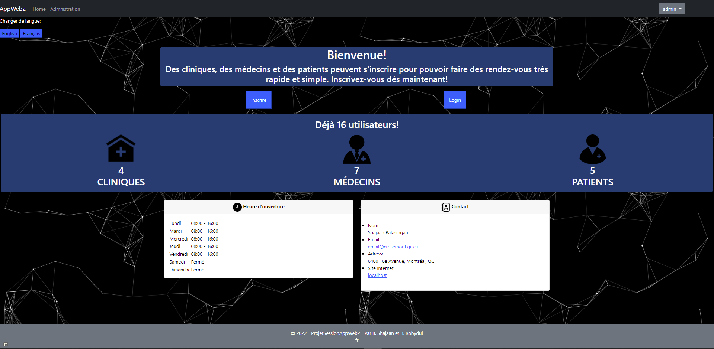

# Projet Final Applications Web 2
## Prise de rendez-vous médical

Le projet final avait pour but de créer un site web pour la prise de rendez-vous par des patients. Ce site a été créé avec **Java EE** qui utilise les JSPs et les Servlets. On a aussi utilisé une base de donée MySQL.

Voici la liste des fonctionnalités se trouvant sur le site :
- Page d’inscription pour un utilisateur, un patient, un médecin et une clinique
- Page de login
- Page d’administrateur qui peut voir, modifier et supprimer les utilisateurs
- Page de profil pour les utilisateurs pour modifier leurs informations
- Patient :
    
    - Page pour prendre et voir les rendez-vous
    - Page pour envoyer des documents à son médecin
- Médecin :
    - Page pour voir et définir leur disponibilité
    - Page pour voir leurs patients et envoyer un email à leur patient
- Clinique :
    - Page pour voir tous les patients et médecins de leur clinique
- Autre fonctionnalité :
    - MVC2
    - Internalisation

Voici la page d'accueil:

